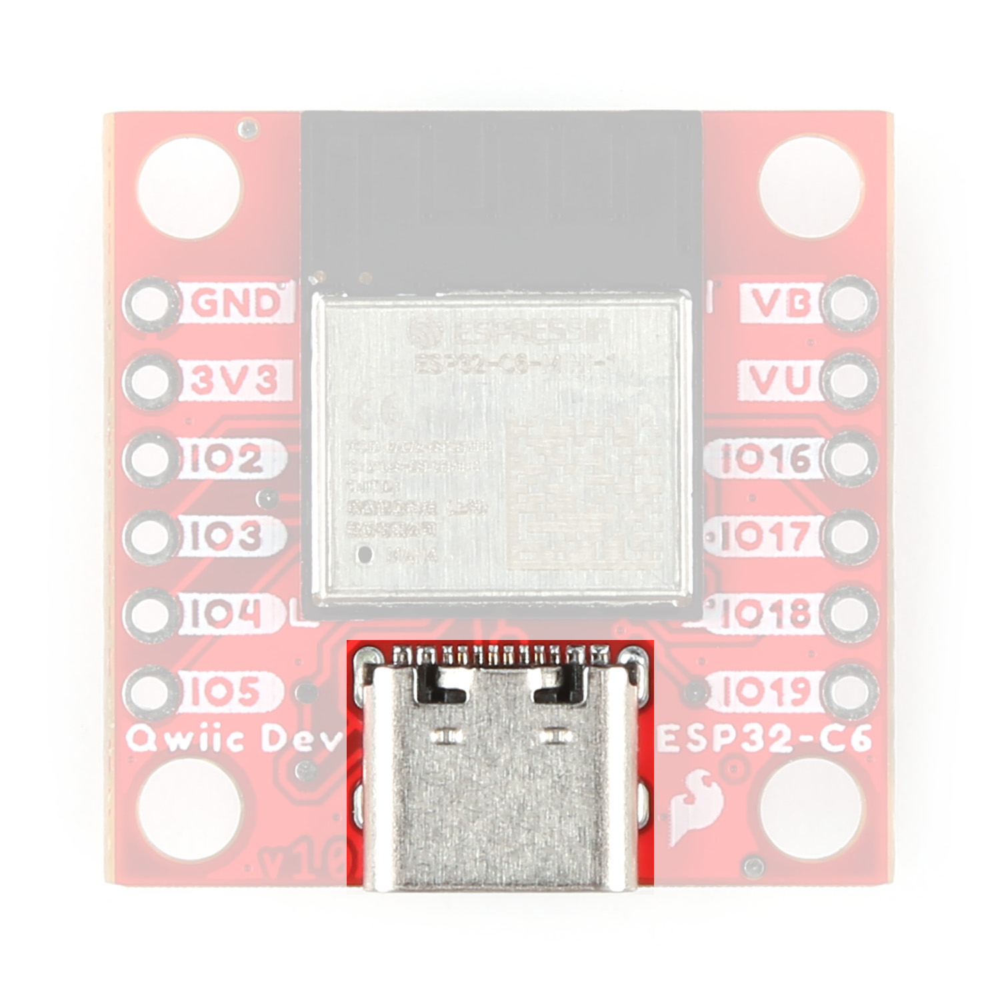
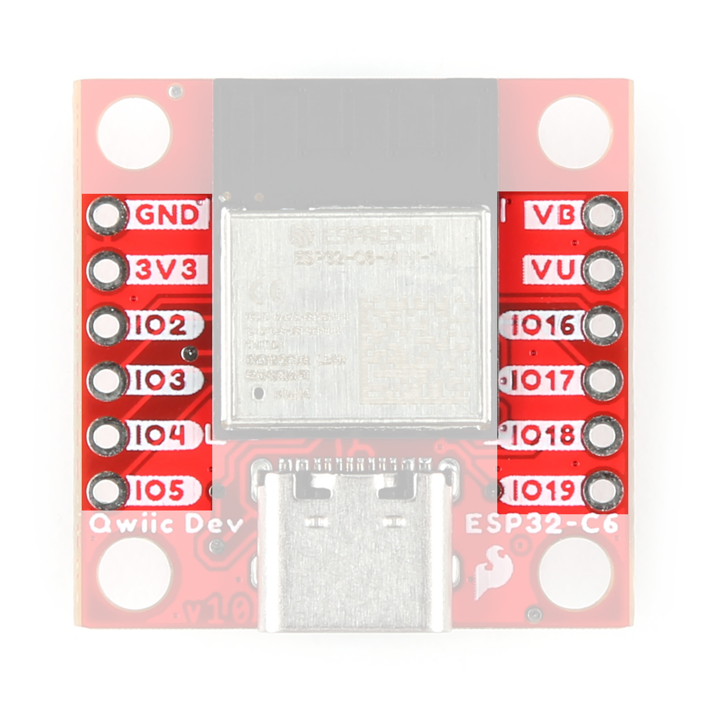
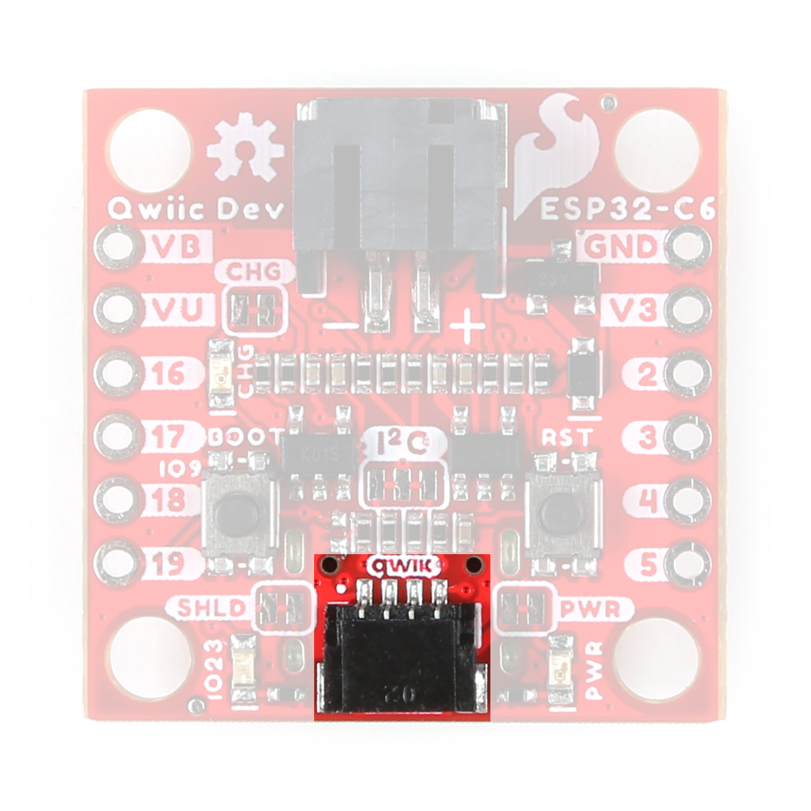
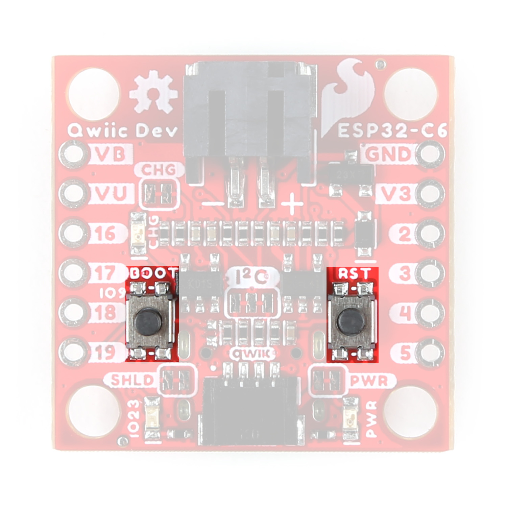
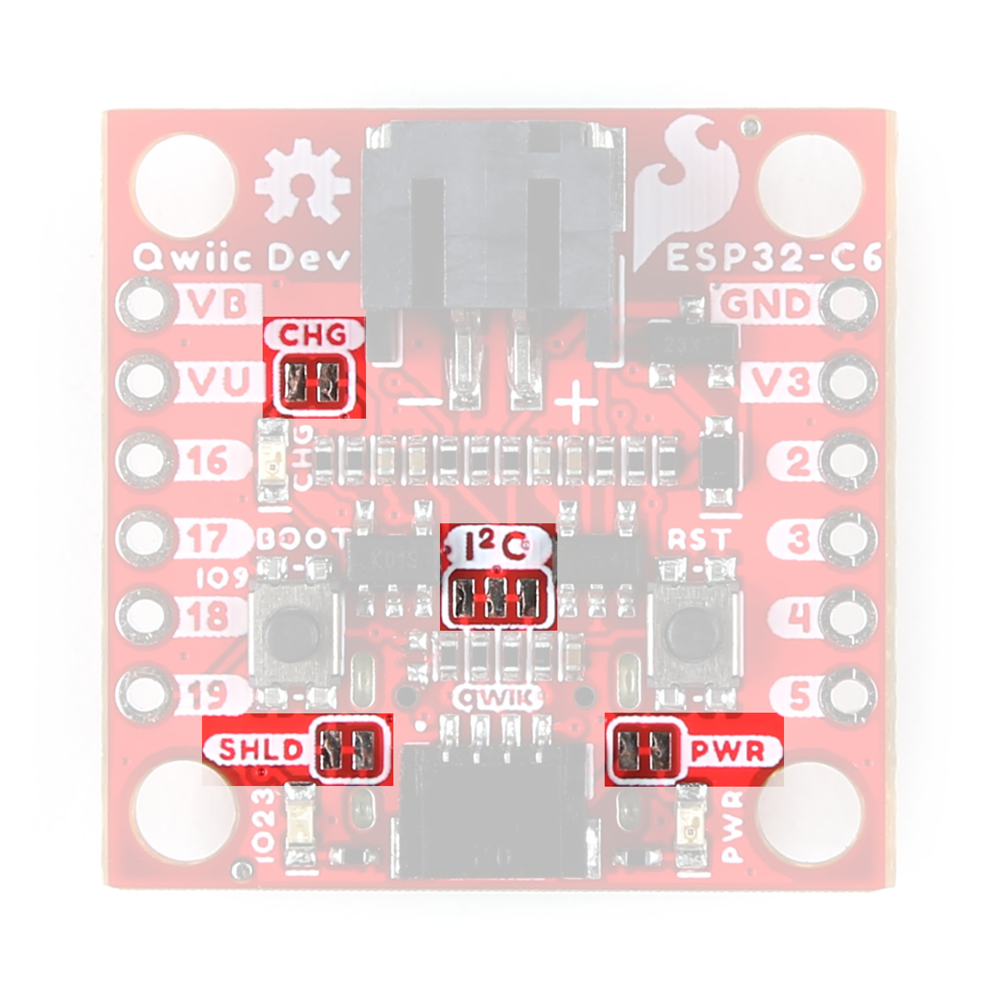

Let's take a closer look at the ESP32-C6 module and other hardware on the Qwiic Pocket Development Board.

## ESP32-C6 Mini-1 Module

The ESP32-C6 Mini-1 module from espressif features a 32-bit RISC-V single-core processor with an integrated wireless stack. The wireless stack is compatible with 2.4 GHz WiFi 6, Bluetooth&reg; 5.3, Zigbee and Thread (802.15.4) and uses an on-board PCB antenna.

<figure markdown>
[{ width="400"}](./assets/images/Pocket_Dev_ESP32-C6_Module.jpg "Click to enlarge")
</figure>

This development board uses the Mini version of the C6 module which has slightly less computing power in exchange for greater power efficiency. This makes this module perfect for battery-powered applications. The module features a wide range of peripheral options including SPI, UART, LPUART, I2C, I2S, LED PWM, USB Serial/JTAG controller, ADC and more. Many of these peripherals can be mapped to any GPIO pin though some are tied to specific pins. The Qwiic Pocket Development Board only has eight PTH pins so options are limited. We recommend the [SparkFun Thing Plus - ESP32-C6]() for those looking for more peripherals. 

The ESP32-C6 has 4 MB Flash memory along with 512 KB SRAM (high power)/ 16 KB SRAM (low power). The module uses pin strapping to configure boot mode parameters. The board defaults to standard mode (GPIO 9 internal pull-up, all other strapping pins floating) but it can be set to other parameters by performing the following pin strapping:

    * SDIO Sampling and Driving Clock Edge - MTMS & MTDI
    * Chip Boot Mode - GPIO8 & GPIO9
    * ROM Code Printing to UART - GPIO8
    * JTAG Signal Source - GPIO15

## Power Components

### USB-C Connector

The USB-C connector on the board acts as the primary serial interface for the ESP32-C6 module as well as a power input. It connects directly to the ESP32-C6's USB serial converter. The <b>5V</b> USB input voltage is regulated down to <b>3.3V</b> through a voltage regulator with a max current of <b>500mA@3.3V</b>.

<figure markdown>
[{ width="400"}](./assets/images/Pocket_Dev_ESP32-USB.jpg "Click to enlarge")
</figure>

### JST Connector & Battery Charger

The board has a 2-pin JST connector to connect a single-cell Lithium Ion (LiPo) battery for battery-powered applications. It also has an MCP73831 battery charger to charge an attached battery. The charge rate is set to <b>214mA@3.3V</b>. The MCP73831 receives power from the V_USB line so it only is powered when <b>5V</b> is provided either over USB or the V_USB PTH pin. If applying voltage directly to the V_USB pin make sure it does not exceed <b>5.5V</b>.

<figure markdown>
[{ width="400"}](./assets/images/Pocket_Dev_ESP32-Battery.jpg "Click to enlarge")
</figure>

## Pinout & Qwiic Connector

### PTH Pins

The Qwiic Dev Board routes eight GPIO pins to a pair of 0.1"-spaced PTH headers. One side has <b>3.3V</b> and <b>GND</b> pins along with I/O pins 2, 3, 4, and 5. The other side has through-holes for <b>V_USB</b> and <b>VBatt</b> as well as I/O pins 16 (TX), 17 (RX), 18, and 19.

<figure markdown>
[{ width="400"}](./assets/images/Pocket_Dev_ESP32-Pinout.jpg "Click to enlarge")
</figure>

### Qwiic Connector

There's a Qwiic connector on the board tied to the ESP32-C6's Low Power I2C bus (I/O pins 6 and 7) for easy integration into SparkFun's Qwiic ecosystem. The Qwiic connector provides connections for SDA, SCL, 3.3V, and Ground.

<figure markdown>
[{ width="400"}](./assets/images/Pocket_Dev_ESP32-Qwiic.jpg "Click to enlarge")
</figure>

## Buttons

There are two buttons on the board labeled <b>RESET</b> and <b>BOOT</b>. The RESET button is tied to the ESP32-C6's Enable (EN) pin and resets the module when pressed. The BOOT button puts the ESP32-C6 into bootloader mode when held down during power on or reset.

<figure markdown>
[{ width="400"}](./assets/images/Pocket_Dev_ESP32-Button.jpg "Click to enlarge")
</figure>

## LEDs

The board has three LEDs labeled <b>PWR</b>, <b>STAT</b>, and <b>CHG</b>. The red Power (PWR) LED indicates whenever the <b>3.3V</b> circuit is powered. The blue Status (STAT) LED is tied to IO20 on the ESP32. The yellow Charge (CHG) LED indicates whenever the MCP73831 is charging a connected LiPo battery.

<figure markdown>
[{ width="400"}](./assets/images/Pocket_Dev_ESP32-LEDs.jpg "Click to enlarge")
</figure>

## Solder Jumpers

There are four solder jumpers on the Qwiic Dev Board labeled <b>CHG</b>, <b>I2C</b>, <b>SHLD</b>, and <b>PWR</b>. The table below outlines the jumpers' labels, default state, function, and any notes regarding their use:

<figure markdown>
[{ width="400"}](./assets/images/Pocket_Dev_ESP32-Jumpers.jpg "Click to enlarge")
</figure>

<table>
    <tr>
        <th>Label</th>
        <th>Default State</th>
        <th>Function</th>
        <th>Notes</th>
    </tr>
    <tr>
        <td>CHG</td>
        <td>CLOSED</td>
        <td>Completes Charge LED circuit</td>
        <td>Open to disable Charge LED</td>
    </tr>
    <tr>
        <td>I2C</td>
        <td>CLOSED</td>
        <td>Pulls the SDA/SCL lines to <b>3.3V</b> through a pair of <b>2.2k&ohm;</b> resistors</td>
        <td>Three-way jumper. Open completely to disable pullups</td>
    </tr>
    <tr>
        <td>SHLD</td>
        <td>CLOSED</td>
        <td>Ties the USB-C shield pin to the ground plane</td>
        <td>Open to isolate USB-C shield pin from the board's ground plane</td>
    </tr>
    <tr>
        <td>PWR</td>
        <td>CLOSED</td>
        <td>Completes the Power LED circuit</td>
        <td>Open to disable the Power LED</td>
    </tr>
</table>

## Board Dimensions

The Qwiic Dev Board - ESP32-C6 matches the 1" x 1" (22.6mm x 22.6mm) Qwiic form factor and has two mounting holes that fit a [4-40 screw](). 