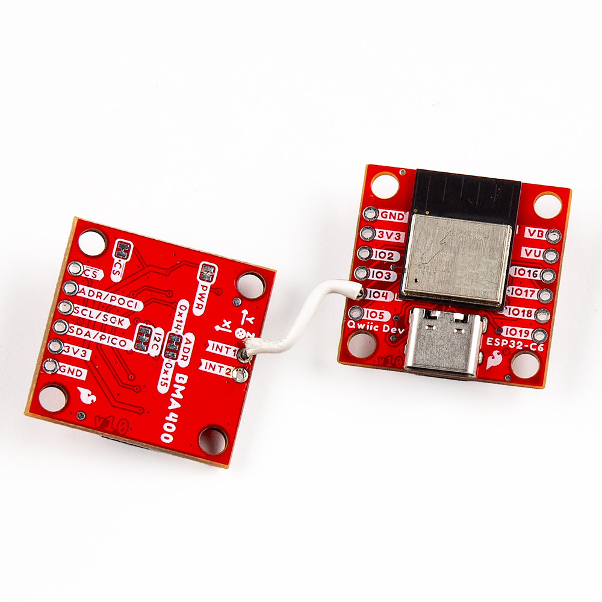
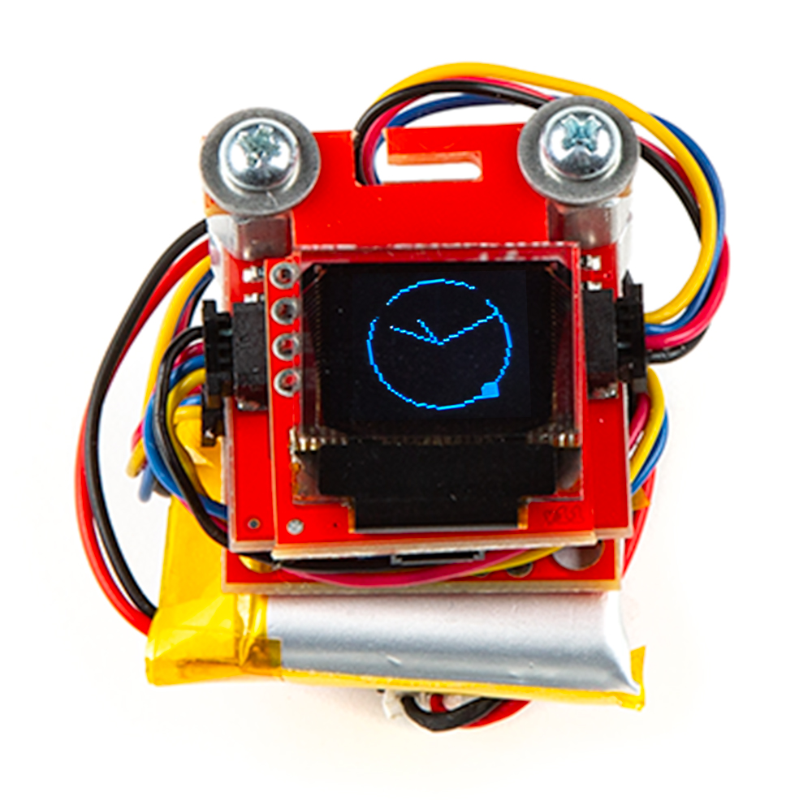

Building the smart watch with the Pocket Development Board and the three Qwiic breakouts requires a few assembly steps to build the smart watch stack and connect everything using standofs, screws, hookup wire, and Qwiic cables. This assembly also requires a bit of through-hole soldering so if you've never soldered before or would like a refresher, take a look at our [How to Solder: Through-Hole Soldering](https://learn.sparkfun.com/tutorials/how-to-solder-through-hole-soldering) tutorial.

!!! note
    Some users may want to skip ahead and program the Qwiic Pocket Development Board before assembling the smart watch. If you are one of these people, skip ahead to the Software Setup and Smart Watch Example sections to upload the code before building your smart watch stack.

Start by soldering a short length of wire (roughly one inch) to pin 4 on the Pocket Dev Board and then solder the other end to INT1 on the BMA400 Breakout:

<figure markdown>
[{ width="400"}](./assets/images/Smart_Watch_Assembly-INT.jpg "Click to enlarge")
</figure>

Next, stack the BMA400 Breakout on top of the Qwiic Pocket Dev Board using two standoffs and two nuts to secure them to the Qwiic Pocket Dev Board; then connect the two with a Qwiic cable like the photo below show: 

<figure markdown>
[{ width="400"}](./assets/images/Smart_Watch_Assembly-BMA400.jpg "Click to enlarge")
</figure>

Now stack the RTC Breakout on top of those two with a Qwiic cable between the BMA400 and RTC breakouts and finally add the Qwiic OLED on top with a Qwiic cable between this and the RTC breakout. You may want to connect the Qwiic cable to the OLED before securing it into place depending on which connector you opt for as one is a bit of a tough reach once the board is attached. Secure everything in place while being careful not to damage any of the components since the standoffs and other hardware come very close to them. 

With the boards stacked and connected together you can plug the battery in at this point, but can also wait until after programming the Pocket Development Board as well. The final assembly should look like the photo below:

<figure markdown>
[{ width="400"}](./assets/images/Smart_Watch_Assembly-Clock.jpg "Click to enlarge")
</figure>